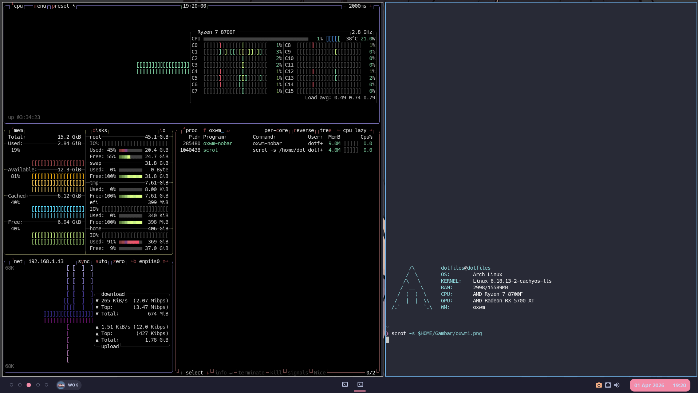

#+TITLE: oxwm-nobar
#+AUTHOR: wandaww

A fork of [[https://github.com/tonybanters/oxwm][oxwm]] with the built-in bar removed and replaced with support for external bars like [[https://github.com/elkowar/eww][EWW]], Polybar, or any other external bar.

* What's Different from oxwm

| Feature                    | oxwm | oxwm-nobar         |
|----------------------------+------+--------------------|
| Built-in bar               | ✅   | ❌ Removed         |
| External bar reserved space| ❌   | ✅ Configurable    |
| Hot-reload bar position    | ❌   | ✅ Via Lua config  |
| =_NET_CURRENT_DESKTOP=     | ❌   | ✅ Added           |
| =_NET_WM_DESKTOP=          | ❌   | ✅ Added           |

* Why?

If you're using an external bar like EWW, the built-in bar is unnecessary. This fork removes it and adds configurable reserved space so windows don't overlap your bar — configurable from the Lua config with hot-reload support (no recompilation needed).

* Dependencies

#+begin_src bash
# Arch / CachyOS / Manjaro
sudo pacman -S zig libx11 libxft freetype2 fontconfig libxinerama lua
#+end_src

* Building from Source

#+begin_src bash
git clone https://github.com/wandaww/oxwm-nobar
cd oxwm-nobar
zig build -Doptimize=ReleaseFast --prefix /usr
#+end_src

Or with a custom binary name to avoid conflicts with oxwm:

#+begin_src bash
zig build -Doptimize=ReleaseFast
sudo cp zig-out/bin/oxwm-nobar /usr/local/bin/oxwm-nobar
#+end_src

* Configuration

On first run, a default config is created at =~/.config/oxwm/config.lua=. Edit it and reload with =Mod+Shift+R=.

** External Bar Reserved Space

Use =oxwm.set_external_bar(position, size)= in your =config.lua=:

#+begin_src lua
-- Position: "top", "bottom", "left", "right"
-- Size: reserved space in pixels

-- Bar at the bottom (default)
oxwm.set_external_bar("bottom", 40)
#+end_src

After changing, press =Mod+Shift+R= to hot-reload — no recompilation needed!

** EWW Bar Example

Make sure your EWW bar matches the position and size:

#+begin_src lisp
(defwindow bar
  :monitor 0
  :geometry (geometry
    :x "0px"
    :y "0px"
    :width "100%"
    :height "40px"
    :anchor "bottom center")  ; change to match your position
  :stacking "fg"
  :exclusive true
  :focusable false
  (bar-widget))
#+end_src

* EWMH Support

oxwm-nobar adds the following EWMH atoms for better external bar compatibility:

- =_NET_CURRENT_DESKTOP= — updates when switching tags (workspace indicator)
- =_NET_WM_DESKTOP= — set per window (taskbar window list per workspace)

This allows scripts using =xdotool get_desktop= and =wmctrl -lx= to work correctly with workspace indicators and taskbars.

* Setting Up

** Without a display manager (startx)

Add to =~/.xinitrc=:

#+begin_src bash
exec oxwm-nobar
#+end_src

** With a display manager

If using LightDM, GDM, or SDDM, create a session file:

#+begin_src bash
sudo cp /usr/share/xsessions/oxwm.desktop /usr/share/xsessions/oxwm-nobar.desktop
sudo sed -i 's/oxwm/oxwm-nobar/g' /usr/share/xsessions/oxwm-nobar.desktop
#+end_src

* Credits

- [[https://github.com/tonybanters/oxwm][tonybanters/oxwm]] — the original oxwm project
- [[https://github.com/elkowar/eww][elkowar/eww]] — the external bar this fork is designed for
